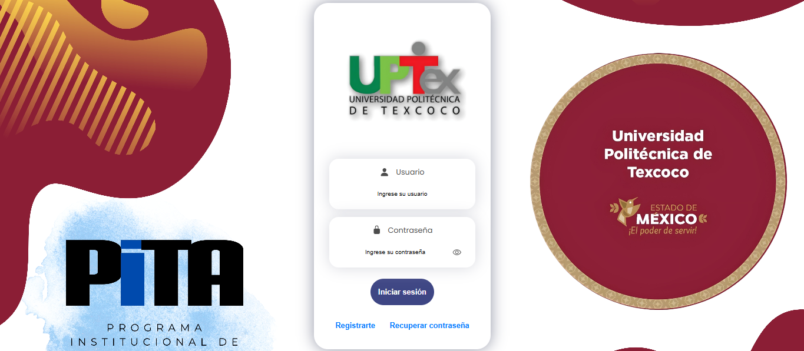
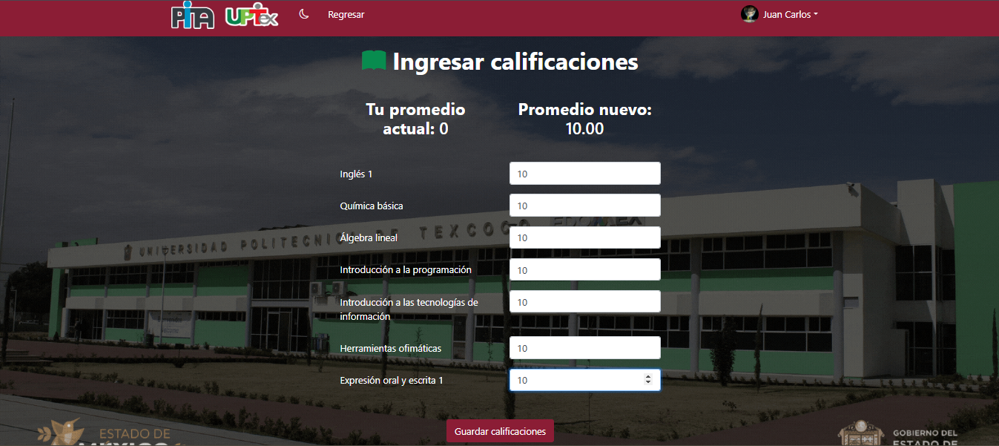
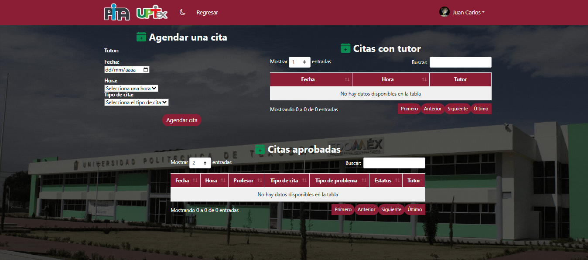
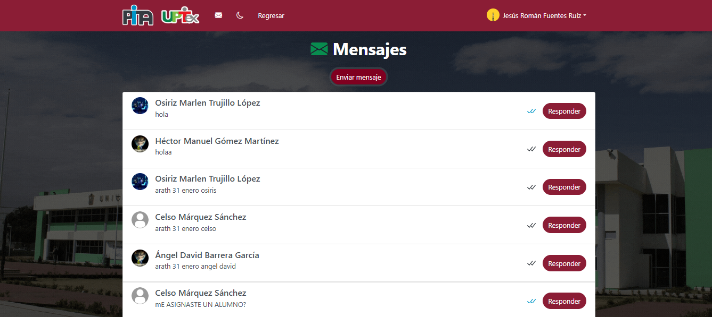
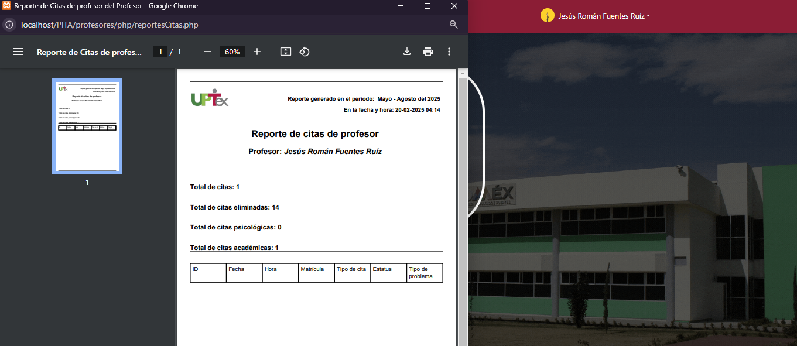
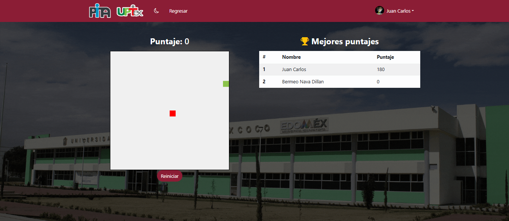
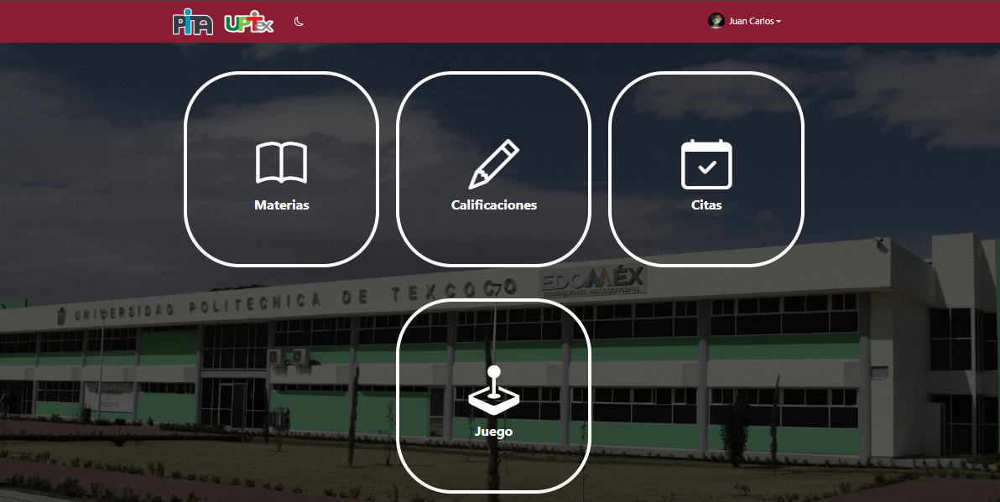
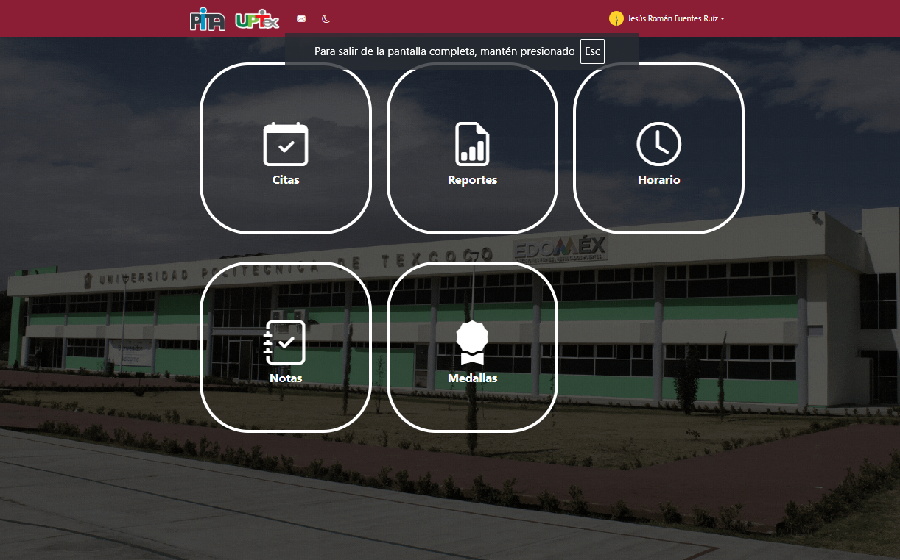

# PITA: Programa Institucional de Tutorías y Asesorías

PITA es un sistema web desarrollado para la UPTex (Universidad Politécnica de Texcoco) que permite a cada miembro de la institución acceder a funcionalidades específicas según su rol jerárquico. Este sistema mejora la gestión académica y administrativa, facilitando la coordinación de tutorías, asesorías, evaluaciones, citas, reportes y más, todo con altos estándares de seguridad y encriptación.

## Tabla de Contenidos
- [Descripción del Proyecto](#descripción-del-proyecto)
- [Características y Funcionalidades](#características-y-funcionalidades)
- [Tecnologías Utilizadas](#tecnologías-utilizadas)
- [Estructura del Proyecto](#estructura-del-proyecto)
- [Instalación y Configuración](#instalación-y-configuración)
- [Uso](#uso)
- [Roadmap](#roadmap)
- [Capturas de Pantalla](#capturas-de-pantalla)
- [Créditos](#créditos)
- [Licencia](#licencia)
- [Contribuciones](#contribuciones)
- [Contacto](#contacto)

## Descripción del Proyecto

PITA es una plataforma integral que gestiona de manera dinámica las actividades académicas y de soporte en la UPTex. Cada usuario se identifica mediante su matrícula y correo institucional, recibiendo acceso a diferentes secciones y privilegios según su rol:

- **Director Académico:** Acceso total a todas las funcionalidades.
- **Jefes de Carrera:** Gestión de grupos, asignación de materias y horarios, activación de encuestas de satisfacción y evaluaciones, generación de reportes y gráficos comparativos.
- **Profesores y Psicólogos:** Administración de citas, notas internas, mensajería entre docentes y seguimiento del desempeño estudiantil.
- **Alumnos:** Ingreso de calificaciones, agendamiento de citas con tutores o psicólogos, visualización de horarios disponibles y participación en actividades de gamificación.

El sistema implementa una robusta seguridad mediante encriptación de datos y contraseñas (SHA256), garantizando la confidencialidad y protección de la información.

## Características y Funcionalidades

- **Autenticación y Registro Seguro**  
  - Inicio de sesión con correo institucional y matrícula.  
  - Recuperación de contraseña mediante código OTP.  
  - **Imagen Representativa:**  
    

- **Gestión de Roles y Privilegios**  
  - Diferentes niveles de acceso para Director, Jefes de Carrera, Profesores/Psicólogos y Alumnos.  
  - Los jefes de carrera pueden asignar grupos, materias y horarios mediante un cronograma y calendario de actividades.

- **Evaluaciones y Avance Académico**  
  - Los alumnos ingresan sus calificaciones, lo que activa evaluaciones y permite el avance automático de cuatrimestres.  
  - Activación de encuestas de satisfacción para medir el desempeño del sistema.  
  - **Imagen Representativa:**  
    

- **Agendamiento de Citas**  
  - Los alumnos pueden reservar citas con profesores tutores o psicólogos, consultando los horarios disponibles.  
  - Visualización de un calendario con días y horarios ocupados.  
  - **Imagen Representativa:**  
    

- **Control de Asistencias y Gestión de Faltas**  
  - Asignación de strikes por inasistencia en citas.  
  - Bloqueo automático de cuenta tras acumular tres strikes, requiriendo intervención del área de sistemas.

- **Comunicación Interna y Notas**  
  - Sistema de mensajería entre profesores.  
  - Registro de notas internas para reuniones y eventos importantes.  
  - **Imagen Representativa:**  
    

- **Reportes y Gráficos Comparativos**  
  - Generación de reportes en PDF que incluyen datos de citas, evaluaciones y encuestas.  
  - Comparativas entre periodos y años para evaluar el progreso institucional.  
  - **Imagen Representativa:**  
    

- **Gamificación**  
  - Juego de Snake integrado que permite a los alumnos acumular puntos y competir en un ranking universitario.  
  - Fomenta la competitividad y el compromiso estudiantil.  
  - **Imagen Representativa:**  
    

- **Personalización de la Interfaz**  
  - Opción de cambiar entre modo oscuro y claro.  
  - Actualización personalizada de la foto de perfil.

## Tecnologías Utilizadas

- **Frontend:** HTML, CSS, JavaScript, Bootstrap, jQuery, SweetAlert.
- **Backend:** PHP.
- **Base de Datos:** MySQL.
- **Seguridad:** Encriptación de datos y contraseñas con SHA256.
- **Generación de Reportes:** PDF.

## Estructura del Proyecto

La estructura del repositorio está organizada de la siguiente manera:

PITA/ ├── css/ │ ├── dark-theme.css │ ├── darktheme.js │ └── navbarStyle.css ├── img/ │ └── (Imágenes generales del proyecto) ├── php/ │ ├── conexion.php │ ├── activarEncuesta.php │ ├── activarEvaluaciones.php │ ├── easter.php │ ├── nuevosMensajes.php │ └── (Otros scripts PHP) ├── readmeimg/ │ ├── login.jpg │ ├── evaluaciones.jpg │ ├── calendario.jpg │ ├── mensajes.jpg │ ├── reportes.jpg │ ├── ranking.jpg │ ├── alumno-dashboard.jpg │ └── profesor-dashboard.jpg ├── sql/ │ └── database.sql ├── indexJefe.php ├── indexAlumno.php ├── indexProfesor.php └──

## Instalación y Configuración

1. **Clonar el Repositorio:**
   ```bash
   git clone https://github.com/dillanava/PITA-Programa-Institucional-de-Tutor-as-y-Asesor-as-

2. **Configuración del Servidor:**

Utiliza XAMPP, WAMP o un servidor LAMP.
Coloca el proyecto en el directorio adecuado (por ejemplo, htdocs en XAMPP).

3. **Configuración de la Base de Datos:**
Importa el archivo SQL disponible en la la carpeta PITA dbs10610773.dbs.
Actualiza las credenciales de conexión en php/conexion.php.

4. **Acceso al Sistema:**
Abre el navegador y visita http://localhost/PITA para iniciar sesión o registrarte.

## USO

Una vez instalado, el sistema permite a los usuarios:

1. Registrarse e Iniciar Sesión:
- Utilizando sus credenciales institucionales, con un sistema seguro de verificación y recuperación de contraseña.

2. Acceder a Funcionalidades Personalizadas:
- Cada usuario visualiza un dashboard adaptado a su rol (por ejemplo, agendar citas, ingresar calificaciones, gestionar evaluaciones, etc.).

3. Gestionar Citas y Evaluaciones:
- Los alumnos pueden consultar horarios y reservar citas; los profesores y jefes de carrera administran evaluaciones y reportes.

4. Participar en el Ranking del Juego:
- El juego de Snake permite acumular puntos y competir en un ranking visible para toda la universidad.

5. Personalizar la Experiencia de Usuario:
- Cambiar entre modo oscuro y claro, además de actualizar la imagen de perfil.


# ROADMAP

1.  | Mejoras en la Interfaz de Usuario:
- Refinar el diseño para una experiencia más intuitiva y moderna.

2.  | Optimización del Rendimiento:
- Mejorar la velocidad de carga y la eficiencia en el manejo de datos.

3.  | Integración de Notificaciones en Tiempo Real:
- Implementar notificaciones para citas, mensajes y actualizaciones importantes.

4.  | Expansión de Reportes y Análisis:
- Incluir nuevas métricas y comparativas históricas para un análisis más profundo.

5.  | Mejoras en la Seguridad:
- Evaluación y actualización constante de los protocolos de encriptación y autenticación.


## CAPTURAS DE PANTALLA

**Pantalla de Login:**
-   

**Dashboard del Alumno:**
-   

**Interfaz del Profesor/Psicólogo:**
-   

**Calendario de Agendamiento de Citas:**
-   

**Sección de Reportes y Gráficos:**
-   

**Ranking del Juego:**
-   


# Créditos
| Desarrollador Principal:
|| <Ing. Dillan Bermeo Nava> +52 5569891361 LinkedIn: www.linkedin.com/in/dillan-bermeo-nava-a36184319/
||| <Ing. Carbajal Silva>
|||| <Ing. Arath Nieto>


# Equipo de Desarrollo:
  *Contribuciones del equipo de PITA.

**Asesores y Colaboradores:**
  *JELB y el equipo académico de UPTex.

**Agradecimientos Especiales:**
  *A mi familia por su apoyo Incondicional.

#NINGUN SISTEMA ES SEGURO

# Licencia
´´´Este proyecto se distribuye bajo la Licencia MIT.´´´

**Contribuciones**
- ¡Las contribuciones son bienvenidas!
- Si deseas contribuir a PITA, sigue estos pasos:

1. **Haz un fork del repositorio.**

2. **Crea una nueva rama para tus cambios:**
-   git checkout -b feature/nueva-funcionalidad

3. **Realiza tus cambios y haz commit:**
-   git commit -m "Agrega nueva funcionalidad..."

4. **Envía tus cambios a tu repositorio remoto:**
-   git push origin feature/nueva-funcionalidad

5. **Abre un Pull Request para revisar tus cambios.**


## Para cualquier duda, sugerencia o reporte de errores, puedes contactar a:

**Dillan Bermeo Nava**
-   Correo: dillan.bermeo@hotmail.com

**Repositorio GitHub:**
-   [github.com/dillanava/PITA-Programa-Institucional-de-Tutor-as-y-Asesor-as-](https://github.com/dillanava/PITA-Programa-Institucional-de-Tutor-as-y-Asesor-as-)

-   **[PITA fue creado con el objetivo de potenciar la gestión académica en la UPTex y fomentar un ambiente de mejora continua y competitividad saludable entre los estudiantes.]**

## Contacto

- **WhatsApp:** [+52 5569891361](https://wa.me/525569891361)
- **LinkedIn:** [Dillan Bermeo Nava](https://www.linkedin.com/in/dillan-bermeo-nava-a36184319/)
- **Portafolio:** [Visita mi portafolio](https://www.behance.net/dillannava)


Sistema Web PITA (Programa Institucional de Tutorias y Asesorias)
© 2025 [Dillan Bermeo Nava]
